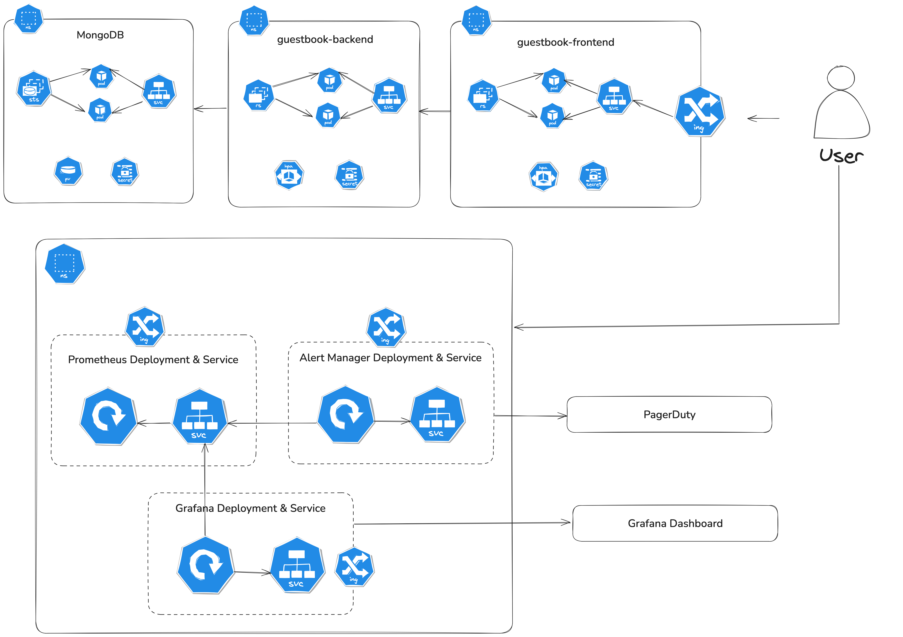

# guestbook-service

The Guestbook sample from https://github.com/GoogleCloudPlatform/cloud-code-samples/tree/v1/python/python-guestbook

Details of the challenge: [instructions.md](instructions.md)

## Features

- Python Flask frontend and backend services
- MongoDB database
- Kubernetes-native deployment using Helm charts
- Monitoring with Prometheus and Grafana
- Support for automated scaling with HorizontalPodAutoscaler
- Pod disruption budgets for high availability
- Ingress configuration for external access

## Prerequisites

- Docker
- Kubernetes cluster (local using [kind](https://kind.sigs.k8s.io/docs/user/quick-start/)). A [script](./start-local.sh) can be used to start a local kind cluster and image registry
- Helm 3.x
- kubectl

## Quick Start

1. Start local environment:

```bash
    ./start-local.sh
```

2. Run provided [Makefile](./Makefile):

```bash
    make all
```

## Architecture Diagram



## Helm Chart Structure

```
├── charts
│   ├── guestbook-backend
│   │   ├── Chart.yaml
│   │   ├── README.md
│   │   ├── dashboards
│   │   │   └── guestbook-backend.json
│   │   ├── templates
│   │   │   ├── NOTES.txt
│   │   │   ├── _helpers.tpl
│   │   │   ├── configmap.yaml
│   │   │   ├── deployment.yaml
│   │   │   ├── grafana-dashboards.yaml
│   │   │   ├── hpa.yaml
│   │   │   ├── pdb.yaml
│   │   │   ├── prometheus-rules.yaml
│   │   │   ├── secret.yaml
│   │   │   ├── service.yaml
│   │   │   └── serviceaccount.yaml
│   │   └── values.yaml
│   ├── guestbook-frontend
│   │   ├── Chart.yaml
│   │   ├── README.md
│   │   ├── dashboards
│   │   │   └── guestbook-frontend.json
│   │   ├── templates
│   │   │   ├── _helpers.tpl
│   │   │   ├── deployment.yaml
│   │   │   ├── grafana-dashboard.yaml
│   │   │   ├── hpa.yaml
│   │   │   ├── ingress.yaml
│   │   │   ├── pdb.yaml
│   │   │   ├── prometheus-rules.yaml
│   │   │   ├── service.yaml
│   │   │   └── serviceaccount.yaml
│   │   └── values.yaml
│   ├── kube-prometheus-stack
│   │   ├── README.md
│   │   └── values.yaml
│   └── mongodb
│       ├── README.md
│       ├── mongodb-exporter.yaml
│       └── values.yaml
```
